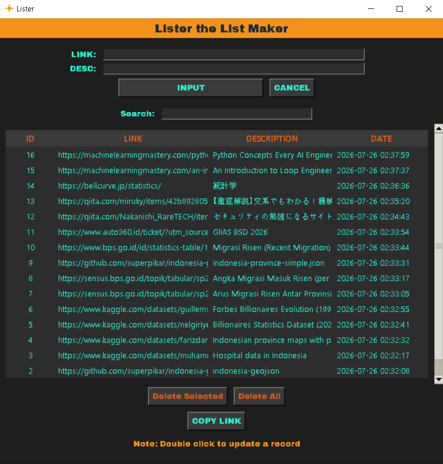

# Lister

A desktop link-tracking app built with Python and Tkinter, backed by a local SQLite database. Save links with descriptions, search through them, and copy them to your clipboard with one click.

I built this to solve a real annoyance, I kept losing track of dataset links, articles, and resources I'd bookmark for job applications and side projects, scattered across browser tabs and sticky notes. Lister gave me a single place to save, search, and grab them quickly, while also being a hands-on way to practice full-stack Python (GUI, database, and clean project structure) end-to-end.



## Features

- Add, edit, and delete saved links with descriptions
- Live search/filter across links and descriptions
- One-click copy-to-clipboard for any saved link
- Persistent local storage via SQLite
- Custom dark theme UI
- Sound feedback on actions (add, delete, close)

## Tech Stack

- **Python** — core application logic, OOP structure
- **Tkinter / ttk** — GUI framework
- **SQLite3** — local database, parameterized queries to prevent SQL injection

## Project Structure

```
lister/
├── main.py     # Entry point
├── gui.py      # App class — all UI logic
├── db.py       # Database class — all data persistence logic
├── fonts/      # Custom font files
├── icons/      # App icon
└── sfx/        # Sound effects
```

## What I Learned

- Structuring a Tkinter app with separated concerns (data layer vs. UI layer)
- Writing parameterized SQL queries to prevent injection
- Common Python pitfalls: mutable default arguments, `.grid()`/`.pack()` return values, closure scoping in loops
- Managing application state (edit mode vs. add mode) cleanly across UI callbacks
- Structuring a multi-file Python project (`main.py`, `gui.py`, `db.py`) with clear separation of responsibilities

## Future Improvements

- [ ] Add unit tests for the `Database` class
- [ ] Export/import saved links as CSV
- [ ] Package as a standalone `.exe` with PyInstaller
- [ ] Multiple database table selections
- [ ] Turn it into .exe 

## Running Locally

```bash
git clone https://github.com/YOUR_USERNAME/lister.git
cd lister
python main.py
```